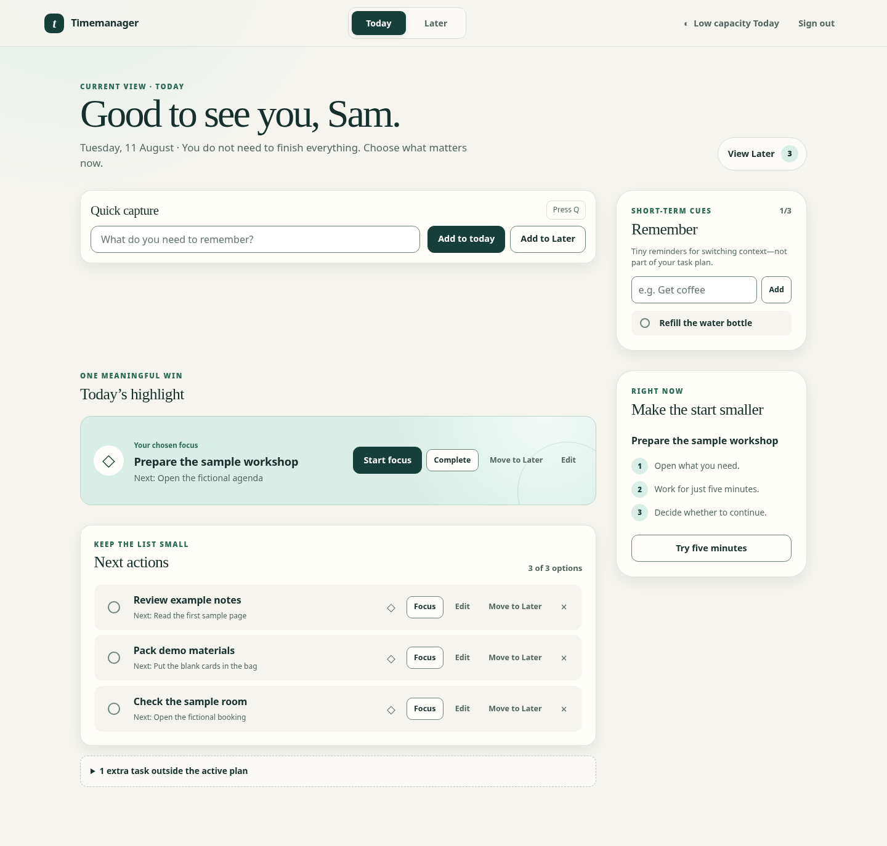
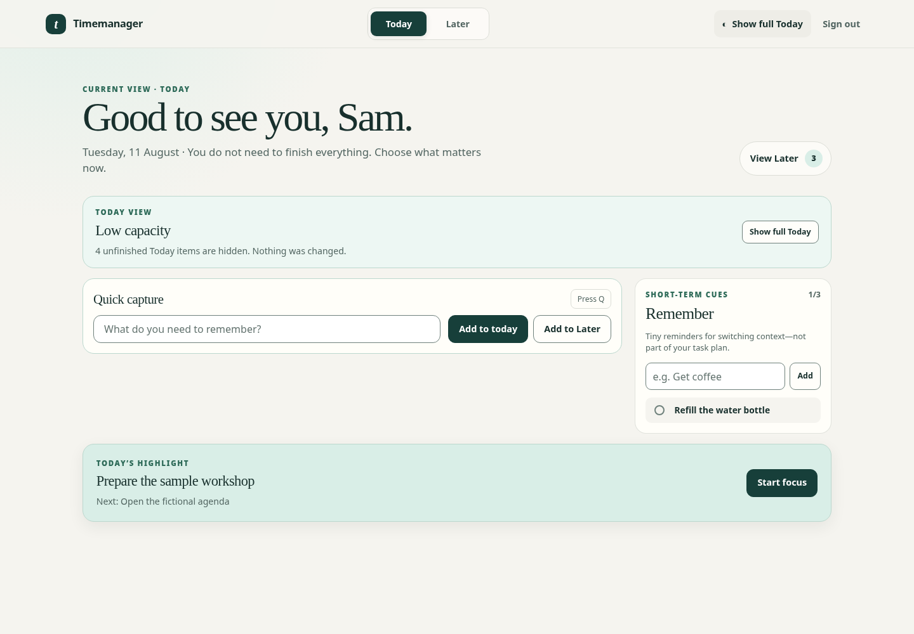
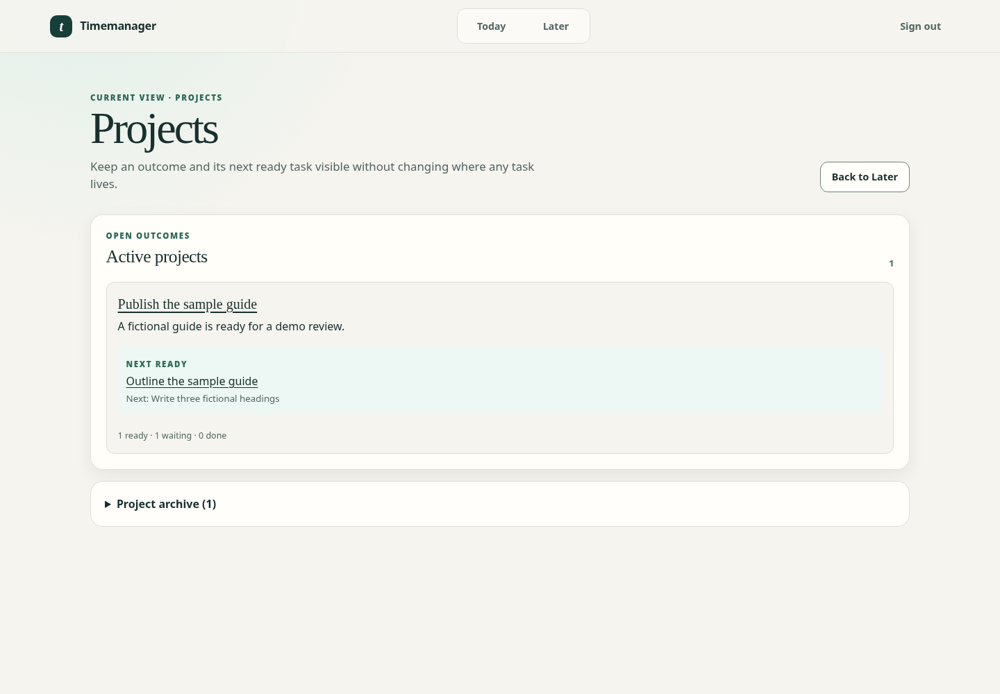

# Time Manager

Time Manager is an early local-first Flask/SQLite PWA for adults who want less
friction when capturing, choosing, starting, and recovering work. It keeps the
active day deliberately small: one highlight, up to three optional actions,
and visible overflow that is never silently promoted or discarded.

This repository is a local development pilot, not a production public service.
It is not medical advice, diagnosis, assessment, treatment, or evidence of
clinical effectiveness.

## Product preview

All images below were generated from a temporary installation using fictional
accounts and tasks. They are product demonstrations, not accessibility or
usability acceptance evidence.

| Bounded Today | Low Capacity | Projects |
| --- | --- | --- |
|  |  |  |

Additional synthetic views: [Later](docs/assets/synthetic-later.png),
[dropped-task recovery](docs/assets/synthetic-recently-dropped.png), and
[mobile Today](docs/assets/synthetic-mobile-today.png).

## Implemented now

- local registration, sign-in, sign-out, password hashing, signed sessions,
  CSRF-protected forms, and account-scoped data access;
- SQLite persistence with ordered Alembic migrations and pre-migration backup
  and restore-on-failure behavior;
- quick capture to Today or Later;
- one daily highlight, up to three optional active Today actions, and explicit
  recoverable overflow;
- a non-mutating Today-scoped Low Capacity view;
- task completion, server-confirmed Drop, and newest-ten dropped-task recovery;
- a three-item Remember list for short-term context-switching cues;
- task details, ordered steps, lightweight projects, prerequisites, external
  waits, and next-ready project work;
- a 5/15/25-minute browser focus timer;
- 24-hour browser-local recovery for interrupted task and project drafts;
- an installable PWA shell whose service worker does not cache authenticated
  navigation responses; and
- operator-level, versioned, account-scoped export/import.

## Known limits

- The trusted installation operator can read the SQLite database, backups,
  generated session secret, and server process memory. Local accounts isolate
  application access from one another; they are not a privacy boundary against
  that operator.
- Flask's development server is loopback-only by default and is not suitable
  for internet-facing or public multi-tenant hosting.
- `SESSION_COOKIE_SECURE` is disabled for the supported local HTTP workflow.
  Do not expose that workflow to an untrusted network.
- Export/import is operator tooling, not self-service account recovery or a
  complete deletion/backup mirror.
- Login rate limiting, production operations, credential recovery, and
  independent security assessment are not part of the local pilot.
- Automated tests do not establish WCAG conformance. Manual keyboard,
  screen-reader, 200%/400% zoom, forced-colors, real-device, and participant
  usability review remain open.

## Not implemented

Calendar integration, Quick Help, Day Context, Medication Context, AI or voice
features, trusted-person sessions, hosted accounts, local-to-online migration,
PostgreSQL hosting, analytics, and native mobile applications remain proposed
or deferred. The material under [`docs_kids/`](docs_kids/) describes a separate
guardian-operated product; it is not a released child application and creates
no child accounts or data flows.

## Five-minute local quick start

Requirements: Python 3.11 or newer and [`uv`](https://docs.astral.sh/uv/).

From a clean clone:

```bash
git clone <repository-url> timemanager
cd timemanager
uv sync --locked
uv run timemanager
```

Open <http://127.0.0.1:5000>, register a fictional or local pilot account, and
capture a task. The supported command binds to loopback and disables Flask
debug mode. Binding to another host does not add TLS or production safeguards.

## Local data and secrets

The default database is `instance/timemanager.sqlite3`; the generated Flask
session secret is `instance/.secret-key`. Both are ignored by Git. Browser-local
task and project drafts may contain sensitive text, are scoped to the signed-in
account/object/form/tab, expire after 24 hours, and are cleared for that account
on sign-out.

Protect copies of `instance/` as account data. A successful schema upgrade may
leave a `*.pre-migration-*.bak` beside a file-backed SQLite database until the
operator verifies and protects the new database. Do not commit databases,
backups, exports, browser profiles, traces, or screenshots made with real data.

## Backup, export, and import boundary

Back up the complete `instance/` directory before pilot data matters. The
operator export command writes a new mode-`0600` JSON file and refuses to
overwrite an existing path:

```bash
uv run flask --app timemanager export-account \
  --email alex@example.com \
  --output ./alex-timemanager.json
```

The file contains the selected account's authored profile and planning data.
It excludes password hashes, session/application secrets, internal database
IDs, and other accounts, but it is still sensitive. Import targets an explicit
existing local account and validates supported formats and relationships
atomically:

```bash
uv run flask --app timemanager import-account \
  --input ./alex-timemanager.json \
  --into-email destination@example.com
```

See the [account-transfer decision](docs/decisions/0004-account-export-import-contract.md)
for version and conflict semantics. Neither command transfers credentials or
replaces protected full-installation backups.

## Verification

The local quality path uses only temporary/synthetic data and no external
application services:

```bash
uv sync --locked
uv run python scripts/check_repository.py
PYTHONDONTWRITEBYTECODE=1 uv run pytest
uv run pytest --cov=timemanager --cov-report=term-missing
uv run python -m compileall -q main.py timemanager tests migrations scripts
uv run flask --app timemanager schema-version
uv run flask --app timemanager export-account --help
uv run flask --app timemanager import-account --help
git diff --check
```

Browser tests require the matching Chromium runtime once on the development
machine:

```bash
uv run playwright install chromium
```

The committed GitHub Actions workflow is configuration only until it runs on
GitHub. Current local evidence and remaining gates are recorded in
[`docs/publication-readiness.md`](docs/publication-readiness.md).

## Documentation and contribution

- [Product direction and explicit status boundaries](docs/high-level-product-design.md)
- [Research and evidence-label index](docs/README.md)
- [Security policy](SECURITY.md)
- [Contribution guide](CONTRIBUTING.md)

## License

Time Manager is licensed under the [Apache License 2.0](LICENSE).

Research distinguishes cited evidence, plausible product hypotheses,
lived-experience signals, and commercial claims. Proposed features must not be
described as shipped, and functional support must not be represented as ADHD
treatment or clinical effectiveness.
