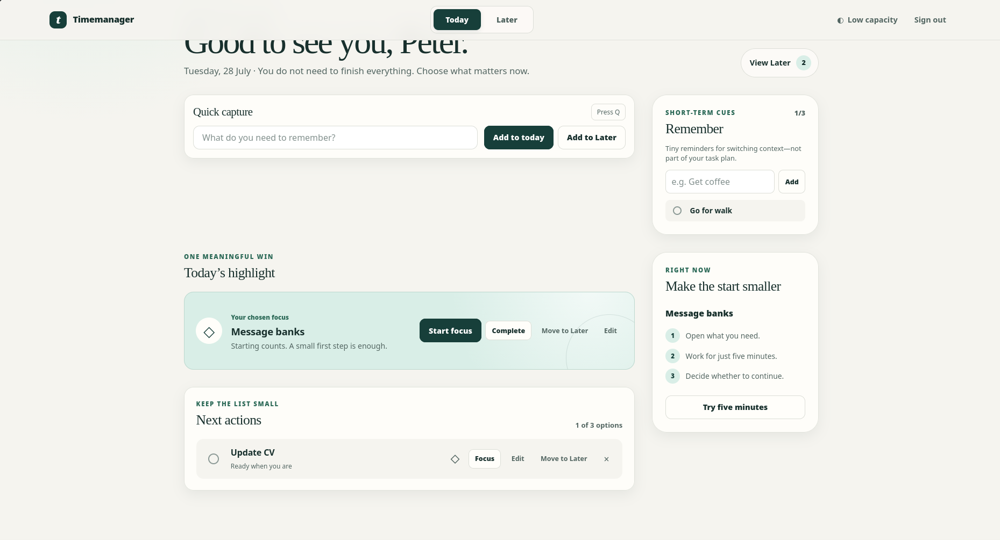
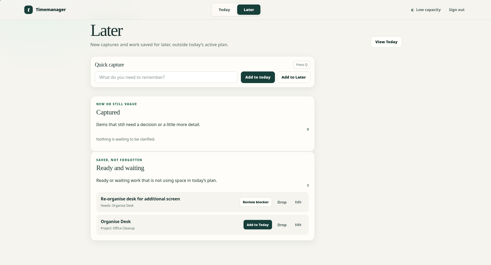

# UI/UX friction audit and requirements

- Status: Current-state audit, product-owner decisions, and proposed
  requirements; not yet participant-usability validated
- Updated: 2026-07-28
- Audited commit: `3cea2d1eff1b4d7fbb75e7c3b5bb576fd1910d92`
- Current implementation revalidation: 87 automated tests on 2026-07-28;
  UX-001 and UX-002 are implemented with automated Chromium and
  JavaScript-disabled coverage, three P0 implementation findings remain open,
  and manual and participant gates remain unverified

## 1. Purpose

This document audits the current Timemanager interface as an existing product.
It is not a visual redesign brief. Its purpose is to preserve useful behavior
while reducing:

- cognitive load and simultaneous choices;
- working-memory and prospective-memory demands;
- task-initiation and context-switching friction;
- accidental or insufficiently recoverable actions;
- interruption-related data loss;
- mobile and keyboard-navigation friction; and
- accessibility barriers against WCAG 2.2 AA.

The recommendations are product-design hypotheses until validated with intended
users. They describe which usability barrier each change is intended to address;
they do not claim to treat ADHD or reduce core ADHD symptoms.

The document uses four evidence states:

- **Observed:** verified in the supplied screenshots, current source, tests, or
  an isolated browser run.
- **Product-owner decision:** the intended product rule confirmed on
  2026-07-28. This validates product intent, not user comprehension or
  effectiveness.
- **Recommended requirement:** a proposed implementation contract derived from
  an observed barrier and the confirmed product rules.
- **Experiment:** an unresolved interaction choice that requires behavioral
  evidence before it becomes a product rule.

This document is not an architecture decision record. Requirements become
implemented behavior only after the corresponding code and tests are complete.

## 2. Evidence and status boundaries

### 2.1 Evidence inspected

The audit used:

- the supplied Today and Later screenshots;
- the current Jinja templates, CSS, JavaScript, Flask routes, service worker, and
  tests;
- the accepted small-Today-plan and complex-work requirements;
- an isolated browser session with synthetic temporary data at desktop, 390 px,
  and 320 px viewport widths;
- direct contrast-ratio calculations from the current CSS tokens; and
- the repository's browser, PWA, and Remember tests.

The isolated browser session did not read or change the user's application
database. The audit did not include a production deployment, real calendar
data, a real mobile device, or an attended screen-reader session.

### 2.2 Supplied screens





### 2.3 Verification run

The following current tests passed during the audit:

```text
uv run pytest tests/test_browser.py tests/test_pwa.py tests/test_remember.py
15 passed
```

Those audit-baseline tests confirmed the behavior at the audited commit; they
did not cover all findings below. In particular, they did not gate contrast,
assistive-technology timer behavior, JavaScript-disabled destructive actions,
immediate-refresh draft recovery, or complete mobile focus order.

A fresh isolated browser and no-JavaScript validation run produced these
results:

- **Later Enter saves to Later:** False. It submitted the primary `Add to today`
  path and opened Today.
- **Low Capacity shows one task when no highlight exists:** False. It hid the
  task and its highlight-selection action.
- **A task-detail draft survives immediate reload:** False. The input returned
  empty.
- **The focus timer survives immediate reload:** False. The focus dialog and
  timer state were gone.
- **Drop requires server confirmation without JavaScript:** False. The task was
  dropped immediately.

These results validate the audited implementation behavior at that time. They
are not participant-usability evidence.

The full isolated automated suite was re-run at `47000ad`:

```text
PYTHONDONTWRITEBYTECODE=1 uv run pytest
72 passed in 19.32s
```

At `47000ad`, source inspection confirmed that task/project drafts still
existed only in page memory, Drop was accepted immediately by the server, the
measured functional colour tokens remained unchanged, the countdown still
updated a polite live region every second, and mobile CSS still moved a
focusable card ahead of its DOM position.

The current implementation adds immediate browser-local draft persistence and
server-confirmed Drop recovery and passes all 87 automated tests. Coverage
includes reload, Back, page close/reopen, failed and delayed requests, sign-out,
expiry, stale and concurrent-tab revisions, and JavaScript-disabled Drop and
Undo. Contrast, timer announcements, and mobile focus order remain unchanged.
Neither revalidation replaces participant evidence, attended screen-reader
sessions, real-device checks, or broader-browser manual verification.

### 2.4 Implemented versus proposed

The current local pilot implements:

- registration, login, and account-scoped task persistence;
- Quick Capture to Today or Later;
- one daily highlight and no more than three optional active actions;
- recoverable Today overflow with no silent promotion;
- Today, Later, Remember, task, project, blocker, and waiting interactions;
- 24-hour account-, object-, form-, revision-, and tab-scoped browser-local
  recovery for interrupted task and project autosave drafts;
- server-confirmed named Drop, immediate Undo, and a newest-ten account-scoped
  recovery surface with separate Later and Today restoration;
- Low Capacity presentation as a partial client-side mode;
- a client-side 5/15/25-minute timer;
- responsive server-rendered pages and a public offline shell; and
- operator-level account export and import.

The following are not implemented as complete user-facing experiences and must
not be described as shipped:

- Calendar commitments and fixed-versus-flexible timeline presentation;
- Reset and return-after-absence recovery;
- persisted focus sessions and transition history;
- self-service restore or credential recovery;
- a project collection and completed/dropped archive;
- hosted accounts, local-to-online migration, or native applications; and
- AI planning, voice, or body-doubling features.

### 2.5 Product, users, goals, and technical constraints

- **Product:** a local-first Flask PWA for immediate capture, a deliberately
  bounded daily plan, focused work, and interruption recovery.
- **Primary users:** adults who experience planning, working-memory,
  task-initiation, or context-switching friction. This functional description
  is suitable for formative recruitment; the product does not diagnose users
  or require a clinical claim.
- **Core goals:** remember something without organizing it first; identify the
  next useful action; start or resume a task; keep Today small; lower visual
  demand when needed; and recover work after interruption or an accidental
  action.
- **Technical constraints:** server-rendered Flask/Jinja, SQLite and SQLAlchemy
  Core, progressively enhanced JavaScript, a responsive PWA, keyboard and touch
  use, and authenticated pages that remain network-only.
- **Product constraints:** the local pilot and non-AI path must remain complete;
  calendar, hosted sync, and native applications remain future work; no
  automatic scheduling, completion, deletion, promotion, or reordering may be
  introduced outside a documented visible rule.

## 3. Product constraints to preserve

All recommendations and implementations must preserve these constraints:

1. Capture remains immediately available and requires only a short title.
2. Today retains one clearly distinguished highlight and no more than three
   optional active actions.
3. Additional captured work remains visible and recoverable in overflow; it is
   not rejected, discarded, or silently promoted.
4. Low Capacity remains a dignified alternative view over the same data, not a
   failure state or separate plan.
5. Calendar commitments, when implemented, remain visually and semantically
   distinct from flexible tasks.
6. The non-AI experience remains complete and useful.
7. Suggestions remain identifiable, editable, dismissible, and reversible.
8. Consequential state changes require clear communication and a safe recovery
   path.
9. Nothing automatically reorders, schedules, deletes, completes, replaces a
   highlight, or promotes work without an explicit visible product rule.
10. Language remains neutral and avoids shame, forced streaks, manufactured
    urgency, productivity scoring, or gamification.
11. Authenticated personal pages remain network-only and are not added to the
    public service-worker cache.

## 4. Current experience

### 4.1 Strong qualities to preserve

- Today and Later form a small, predictable primary navigation.
- The mint highlight treatment establishes one clearly distinguished daily
  focus.
- The active plan is genuinely bounded rather than merely described as small.
- Overflow is explicit, collapsed, and never silently promoted.
- Capture remains a one-field path with no mandatory project, duration,
  priority, energy, or date classification.
- Blocker explanations name the prerequisite or waiting reason in text.
- Task detail shows the first three steps and progressively discloses the rest.
- The product tone is generally calm, supportive, and non-gamified.
- The markup includes a skip link, landmarks, current-view semantics,
  accessible control names, CSRF protection, and reduced-motion handling.
- The responsive layout reflowed at 320 px without horizontal page scrolling.
- Authenticated pages are fetched from the network and are not stored in the
  public application-shell cache.

### 4.2 Weak qualities requiring attention

- The intended `Remember`, `Capture`, then `Start` return sequence is not
  explicit, and oversized utility/coaching regions delay the primary start
  action.
- Too many planning, execution, editing, movement, completion, and destructive
  actions appear simultaneously.
- Low Capacity is partial, inconsistent across screens, and can hide the only
  way to choose a highlight.
- Destructive or consequential actions do not consistently provide end-user
  recovery.
- An interrupted task-detail edit can lose unsaved text.
- Mobile visual order and sequential keyboard order diverge.
- Several control boundaries, focus indicators, and placeholder text fall below
  relevant contrast thresholds.
- The timer exposes a live update every second to assistive technology and loses
  its state across interruptions.
- Global flash messages do not consistently restore visual or keyboard context
  to the object that changed.

### 4.3 Browser measurements

The isolated synthetic browser session found:

- approximately 248 px between the bottom of Quick Capture and the top of the
  highlight at 1860 x 1000;
- the highlight beginning around y=1246 at 390 x 844, below the heading,
  capture, Remember, and the 336 px start-smaller card;
- no horizontal overflow at 390 px or 320 px;
- 17 visible targets under 44 px at 390 px, including 32 px Remember controls,
  33.6 px highlight/drop icon buttons, and 36 px compact task actions;
- a Low Capacity state with an active task but no highlight in which the task
  and its Make-highlight control were both hidden;
- no visible content difference between Low Capacity and standard Later;
- immediate reload after typing into task detail restored an empty value; and
- navigation after an intentionally failed save also restored an empty value.

### 4.4 Contrast measurements

Calculated from the current CSS colors:

| Element or state | Measured ratio |
| --- | ---: |
| Coral focus color against paper | 2.57:1 |
| Coral focus color against the light surface | 2.81:1 |
| Default input border against the light surface | 1.34:1 |
| Default input border against paper | 1.23:1 |
| Placeholder text against white | 3.32:1 |
| Circular task-control border against paper | 2.66:1 |
| Circular task-control border against the light surface | 2.90:1 |
| Soft body text against paper | 5.62:1 |
| White text against the primary forest color | 11.61:1 |

WCAG 2.2 AA requires at least 3:1 for visual information needed to identify
control boundaries and authored focus states, and at least 4.5:1 for ordinary
text such as non-incidental placeholder text. The existing dark primary text and
white-on-forest primary controls are strong; the lighter control tokens require
revision.

## 5. Evaluation scales

### 5.1 Severity

- **Blocking:** prevents safe or accessible completion, creates a material
  data-loss risk, or leaves no credible in-product recovery.
- **High:** substantially increases friction in a common core workflow.
- **Medium:** impairs comprehension, consistency, confidence, or recovery but
  has a usable workaround.
- **Low:** optional refinement with limited behavioral impact.

### 5.2 Priority

- **P0:** prevents completion, creates a safety/accessibility problem, or risks
  data loss.
- **P1:** substantially reduces common friction.
- **P2:** improves comprehension, consistency, or recovery.
- **P3:** optional polish.

Priority reflects implementation order; severity reflects user impact.

## 6. Prioritized findings

### UX-001: Interrupted autosave can lose task or project text

- **Priority:** P0
- **Implementation status:** Implemented in the current source with automated
  Chromium coverage. Manual Firefox/WebKit, true-offline, keyboard-focus,
  screen-reader, Cache Storage, and participant-usability evidence remains
  open.
- **Severity:** Blocking
- **Screen or workflow:** Task and project workspaces; inline task editing
- **Observed baseline problem:** At the audited commit, autosave was delayed and
  relied on an asynchronous fetch. An immediate reload lost a newly entered
  next action. An aborted save followed by navigation also lost the draft.
- **Likely user impact:** The user must reconstruct thoughts after exactly the
  kind of interruption the product is intended to support. Loss may not be
  noticed until later.
- **Recommended change:** Preserve a scoped local draft immediately and clear it
  only after the server confirms the same version. Warn before navigation while
  a save remains unresolved.
- **Why this should reduce friction:** The system, rather than the user, retains
  the interrupted thought and makes the return state explicit.
- **Implementation notes:** Use account- and object-scoped session storage or
  another reviewed local-draft boundary; expire drafts; clear them on successful
  acknowledgement and sign-out; do not put personal text in the public
  service-worker cache. Keep visible `Unsaved`, `Saving`, `Saved`, and `Could not
  save` states. Resolve revision conflicts before overwriting server data. The
  implementation uses local storage with account, object, form, revision, and
  per-tab identity, 24-hour expiry, and explicit stale-revision actions.
- **How to validate:** Automated coverage now gates reload, Back, close/reopen,
  aborted and delayed requests, retry, sign-out, expiry, and concurrent-tab
  revision conflicts. A true offline browser return and the manual gates above
  remain.

### UX-002: Dropped tasks lack complete end-user recovery

- **Priority:** P0
- **Implementation status:** Implemented in the current source with automated
  server, migration, transfer, account-isolation, and JavaScript-disabled
  Chromium coverage. Manual touch, complete keyboard, broader-browser, and
  participant-usability evidence remains open.
- **Severity:** Blocking
- **Screen or workflow:** Today and Later task rows; task recovery
- **Observed baseline problem:** At the audited commit, Drop confirmation was a
  JavaScript-only `window.confirm`. Without JavaScript, the form submitted
  directly and dropped tasks left all ordinary user-facing views.
- **Likely user impact:** A mis-tap or keyboard mistake can make personal work
  effectively disappear and reduce trust in the system.
- **Product-owner decision:** Drop is a soft delete. The ten most recently
  dropped tasks must remain available for recovery. Older dropped tasks remain
  in protected database storage and account export; no deeper archive or purge
  is included in this slice.
- **Recommended change:** Require a server-enforced named confirmation, show
  immediate Undo, and add an account-scoped `Recently dropped` list containing
  the newest ten dropped tasks.
- **Why this should reduce friction:** The consequence is explicit and a user
  can recover an accidental action without operator or database help.
- **Implementation notes:** The implementation stores `dropped_at`, requires
  the exact title and current revision on a server-rendered confirmation, shows
  immediate Undo, restores to Later by default, and offers separate Add to
  Today for unblocked tasks. CSRF and account ownership remain enforced.
- **How to validate:** Automated coverage gates JavaScript-disabled operation,
  repeated submission, stale revisions, Undo, newest-ten ordering, the
  eleventh retained in export, cross-account access, migration, transfer, and
  Later/Today restoration. Manual touch, full keyboard, and participant gates
  remain.

### UX-003: Several visual control and focus indicators miss contrast thresholds

- **Priority:** P0
- **Severity:** Blocking
- **Screen or workflow:** Global controls, forms, task completion, keyboard focus
- **Observed problem:** Input borders, the circular task-control border, and the
  authored coral focus treatment measure below 3:1. Placeholder text measures
  below 4.5:1.
- **Likely user impact:** Users with low vision, reduced contrast sensitivity,
  glare, or magnification may not reliably identify controls or keyboard focus.
- **Recommended change:** Introduce separate, tested tokens for normal text,
  muted text, placeholder text, control boundaries, disabled controls, and focus
  indicators.
- **Why this should reduce friction:** Controls and current focus remain
  recognizable without relying on fine color differences.
- **Implementation notes:** Retain the calm palette while darkening functional
  boundaries. Require at least 3:1 for active control edges and focus indicators,
  and 4.5:1 for ordinary text. Add a non-color shape or underline where
  appropriate. Verify focus against every adjacent surface, not only white.
- **How to validate:** Add automated color-token checks and conduct keyboard,
  200% zoom, high-contrast/forced-colors, and real-display review.

### UX-004: The live countdown may be announced every second

- **Priority:** P0
- **Severity:** High
- **Screen or workflow:** Focus dialog
- **Observed problem:** The countdown element uses `aria-live="polite"` and its
  text changes every second.
- **Likely user impact:** Screen readers may repeatedly announce timer changes,
  compete with controls, or create an unusable stream of status messages.
- **Recommended change:** Expose the countdown as a timer with live updates off,
  and announce only meaningful state transitions.
- **Why this should reduce friction:** The time remains available on demand
  without becoming a repeated interruption.
- **Implementation notes:** Use `role="timer"` with an accessible name. Use a
  separate polite status region for `Timer started`, `Paused with 3 minutes
  remaining`, and `Boundary reached`.
- **How to validate:** Run NVDA/Firefox, NVDA/Chrome, and VoiceOver/Safari
  sessions through start, pause, resume, duration change, boundary, and close.

### UX-005: Mobile visual and keyboard focus order diverge

- **Priority:** P0
- **Severity:** High
- **Screen or workflow:** Mobile Today and fixed bottom navigation
- **Observed problem:** CSS moves the start-smaller card before the main task
  column visually while it remains after that column in the DOM. Sequential
  focus therefore moves through lower task actions, jumps back to the higher
  card, then reaches the visually persistent bottom navigation last.
- **Likely user impact:** Sighted keyboard and magnifier users may lose the
  current interaction point or misinterpret content relationships.
- **Recommended change:** Make DOM and visual order agree and use one primary
  navigation element styled for the breakpoint.
- **Why this should reduce friction:** Focus movement becomes spatially
  predictable and navigation remains reachable without traversing the page.
- **Implementation notes:** Do not use CSS row reassignment to move a focusable
  card ahead of its source order. Prefer keeping start guidance within or after
  the highlight on mobile. Verify sticky header/footer overlap.
- **How to validate:** Tab and reverse-tab at 320 px, 390 px, tablet, desktop,
  200% zoom, and with a screen magnifier. No focused control may be fully
  obscured.

### UX-006: Today does not express the intended return sequence clearly

- **Priority:** P1
- **Severity:** High
- **Screen or workflow:** Today, especially mobile
- **Observed problem:** Quick Capture and Remember share a grid row whose height
  pushes the highlight downward. Mobile also places the full start-smaller card
  before the highlight, while source and visual order differ.
- **Likely user impact:** A returning user must infer an order among several
  legitimate actions and scroll a long distance before reaching the chosen
  work.
- **Product-owner decision:** The intended Today sequence is `Check Remember`,
  then `Capture something`, then `Start highlight`.
- **Recommended change:** Express that sequence in visual, DOM, and keyboard
  order. Keep Remember and Capture compact enough that the highlight and Start
  remain easy to reach. Do not turn the three steps into a blocking wizard.
- **Why this should reduce friction:** The interface supplies a predictable
  re-entry routine while preserving immediate capture and the selected focus.
- **Implementation notes:** Remove the shared-height dependency, reduce the
  greeting's mobile footprint, and label the regions clearly. The content and
  placement of generic start guidance remain an experiment; it must not displace
  or duplicate the highlight's primary Start action in a way that obscures this
  sequence.
- **How to validate:** Ask returning participants what they would do first,
  measure completion of the three-step sequence without prompting, time until
  Start is identified, scroll distance, and first-click accuracy.

### UX-007: Low Capacity can hide the only route to a startable task

- **Priority:** P1
- **Severity:** High
- **Screen or workflow:** Low Capacity Today; toggle on Later and workspaces
- **Observed problem:** If active tasks exist but no highlight is selected, Low
  Capacity hides those tasks and their Make-highlight controls. The toggle has
  no visible content effect on Later or task/project workspaces.
- **Likely user impact:** The alternative view becomes a dead end inside the
  mode and behaves inconsistently across screens.
- **Product-owner decision:** Low Capacity must be a lower-demand,
  lower-pressure Today view showing only the highlight, or one Today task when
  no highlight is selected.
- **Recommended change:** Show the existing highlight; otherwise show the first
  active Today task using the existing deterministic Today order without
  assigning it as the highlight or changing any task state. Retain compact
  Remember and Capture utilities, a hidden-item count, and `Show full Today`.
  Until other screens have meaningful behavior, scope or label the control as a
  Today view.
- **Why this should reduce friction:** The mode always offers a startable action
  and one task choice at most while making hidden work trustworthy.
- **Implementation notes:** Preserve the same underlying task objects and Today
  limits. The no-highlight fallback is presentation only: never auto-select,
  promote, reorder, complete, or otherwise mutate it. If no actionable Today
  task exists, show a calm empty state and `Show full Today`. Announce the active
  mode and hidden count without describing reduced capacity as failure.
- **How to validate:** Test with no tasks, optional tasks but no highlight, a
  highlight, blockers, overflow, completed work, refresh, and navigation.
  Confirm exactly one flexible task is visible and hidden work is unchanged.

### UX-008: Task rows present too many simultaneous actions

- **Priority:** P1
- **Severity:** High
- **Screen or workflow:** Today highlight, optional task rows, Later rows
- **Observed problem:** An optional task can expose completion, highlight,
  Focus, Edit, Move to Later, and Drop at once. The diamond and multiplication
  icons require recognition of product-specific meanings.
- **Likely user impact:** Scanning becomes an action-selection task before the
  user can begin the underlying work. Nearby controls increase accidental-action
  risk.
- **Recommended change:** Show completion, task title/next action, and one
  context-specific Start action. Place Edit, Move, Highlight, and Drop behind a
  labeled `More` control.
- **Why this should reduce friction:** Each row answers `What is this?` and `How
  do I start?` before exposing planning and maintenance choices.
- **Implementation notes:** Keep destructive actions separated from ordinary
  actions inside the menu. Use text labels rather than icon-only product
  semantics. Preserve full keyboard operation and visible focus.
- **How to validate:** Compare time-to-start, action-recognition errors, menu
  errors, and accidental state changes against the current rows.

### UX-009: Several mobile targets are smaller than the preferred touch size

- **Priority:** P1
- **Severity:** High
- **Screen or workflow:** Mobile header, Remember, task rows, focus dialog,
  component reordering
- **Observed problem:** The measured page had 17 targets below 44 px. Important
  controls included 32 px Remember, 33.6 px icon, and 36 px compact buttons.
- **Likely user impact:** One-handed use, movement, reduced fine-motor precision,
  or large fingers increase mis-taps.
- **Recommended change:** Provide at least a 44 x 44 px effective hit area for
  mobile controls while retaining calm visual density.
- **Why this should reduce friction:** Larger hit areas reduce precision demands
  and accidental neighboring actions.
- **Implementation notes:** The WCAG 2.2 AA minimum is 24 x 24 CSS px with
  exceptions; 44 px is a stronger product target rather than a claim about the
  minimum conformance threshold. The visible glyph may remain smaller than its
  hit area.
- **How to validate:** Measure all effective targets and run one-handed task
  completion and accidental-activation testing on real devices.

### UX-010: Capture and Remember use overlapping language

- **Priority:** P1
- **Severity:** High
- **Screen or workflow:** Quick Capture on Today and Later; Remember
- **Observed problem:** The task-capture placeholder asks `What do you need to
  remember?` beside a separate feature named Remember. Later still presents
  `Add to today` as the primary capture action.
- **Likely user impact:** The user must infer whether a thought is a task,
  short-term cue, or Later item before saving it, and may choose the wrong
  destination.
- **Product-owner decision:** The default destination is Today while the new
  item fits within the bounded active plan; when the plan is full, the default
  is Later. The explicit alternative remains available.
- **Recommended change:** Give the field a visible `Task or thought` label.
  Make the capacity-aware destination and its reason visible before submission.
  Pressing Enter must use the same destination as the visually primary action.
- **Why this should reduce friction:** Capture can precede organization and the
  two memory-support mechanisms remain distinguishable, while the user can
  predict where the item will go.
- **Implementation notes:** Preserve one-field capture and keyboard submission.
  Interpret `three or fewer Today items` through the accepted one-highlight plus
  three-optional-action invariant: default to Today only when adding the item
  will not exceed that active-plan capacity. Otherwise default to Later. An
  explicit `Add to Today` may still use the existing recoverable overflow path;
  it must not displace or promote another task. Use the same rule on Today and
  Later rather than making the current screen determine the Enter behavior.
- **How to validate:** Test every capacity state, with and without a highlight.
  Ask participants to predict the destination before pressing Enter, then
  capture a vague thought, urgent task, and temporary Remember cue without
  instruction.

### UX-011: State changes disrupt context and provide limited immediate recovery

- **Priority:** P1
- **Severity:** High
- **Screen or workflow:** Capture, Complete, Move to Later, highlight selection
- **Observed problem:** State-changing forms reload or navigate to another view.
  Feedback appears in a fixed flash region, but focus and scroll do not return
  to the changed item.
- **Likely user impact:** Users must relocate the capture field or list position,
  and moving one task can unexpectedly interrupt the current view.
- **Recommended change:** Keep the user in the originating context when safe,
  restore focus to a logical target, and expose `Undo` plus an optional
  destination link.
- **Why this should reduce friction:** The consequence is visible and reversible
  without requiring navigation memory.
- **Implementation notes:** Preserve a server-rendered POST/redirect fallback.
  Progressive enhancement may update only the affected row, but it must retain
  CSRF, ownership, conflict, and no-JavaScript behavior.
- **How to validate:** Test repeated capture, keyboard focus after every
  mutation, screen-reader status announcements, Back, refresh, and Undo.

### UX-012: Focus controls and state do not support interruption and resumption

- **Priority:** P1
- **Severity:** High
- **Screen or workflow:** Focus timer
- **Observed problem:** Closing or refreshing loses the selected task and timer
  state. `Continue` means either resume or start a new interval. Boundary copy
  mentions Stop without a visible Stop control.
- **Likely user impact:** Users must reconstruct session state after an
  interruption and interpret controls at the moment a decision is required.
- **Product-owner decision:** A running timer must continue through ordinary
  same-device interruption, navigation, dialog close, and refresh.
- **Recommended change:** Persist the task, selected duration, deadline, paused
  state, and remaining time. Use specific labels such as `Resume timer`, `Start
  another 5 minutes`, and `End session`.
- **Why this should reduce friction:** Returning to focus becomes recognition of
  a saved state rather than reconstruction from memory.
- **Implementation notes:** Persistence can remain local and non-AI. Store a
  deadline and recalculate elapsed time on return rather than relying only on an
  in-page interval. Distinguish running from intentionally paused state. Do not
  describe cross-device continuation, focus history, or transition logging as
  implemented until it exists. Show explicit boundary choices and preserve an
  easy safe exit.
- **How to validate:** Test page reload, dialog close/reopen, browser background,
  same-site navigation, pause, system clock changes, boundary, and end-session
  paths.

### UX-013: Complex-work disclosures still reveal dense competing forms

- **Priority:** P1
- **Severity:** High
- **Screen or workflow:** Task detail and project assignment
- **Observed problem:** `Needs and waiting` reveals a prerequisite search and a
  separate four-field waiting form together. Project creation and assignment
  share one disclosure and are documented as easy to conflate.
- **Likely user impact:** Clarifying one task requires parsing two relationship
  models and several optional fields simultaneously.
- **Recommended change:** First present two concrete choices: `Needs another task
  first` and `Waiting on someone or something`. Reveal one matching form.
  Separate `Add to an existing project` from `Create a project`.
- **Why this should reduce friction:** Recognition of a situation precedes
  metadata entry and only relevant controls appear.
- **Implementation notes:** Preserve explicit user confirmation and the existing
  rule that blocker changes do not silently alter Today placement.
- **How to validate:** Ask participants to add a prerequisite, external wait,
  follow-up task, existing-project assignment, and new-project conversion
  without facilitator assistance.

### UX-014: Later gives too much space to an empty first section

- **Priority:** P2
- **Severity:** Medium
- **Screen or workflow:** Later
- **Observed problem:** The empty Captured card remains visually large and pushes
  two useful saved tasks downward. Actionable and blocked work share `Ready and
  waiting`.
- **Likely user impact:** Absence of captured work consumes more attention than
  the available work, and readiness takes longer to scan.
- **Recommended change:** Collapse an empty Captured state to one quiet row.
  Rename the second section `Saved for later` and preserve an explicit textual
  Ready, Waiting, or Blocked status per row.
- **Why this should reduce friction:** Empty information recedes while useful
  work and its state remain visible.
- **Implementation notes:** Do not split the screen into many permanent filters.
  Evaluate search or lightweight grouping only with a realistic backlog.
- **How to validate:** Find an actionable item and a blocked item in synthetic
  Later states containing 0, 2, and 20 items.

### UX-015: Authentication and field errors are not tied to the affected input

- **Priority:** P2
- **Severity:** Medium
- **Screen or workflow:** Registration, login, and form validation
- **Observed problem:** Errors appear in the global flash region without
  persistent field-linked text, `aria-invalid`, or focus on the affected input.
- **Likely user impact:** Correction requires scanning the page and remembering
  which field caused the error.
- **Recommended change:** Add a focused error summary and persistent inline
  error beside each affected field while retaining entered non-secret values.
- **Why this should reduce friction:** The interface identifies both the problem
  and its correction at the point of action.
- **Implementation notes:** Associate messages with `aria-describedby`, set
  `aria-invalid`, focus the first invalid field or error summary consistently,
  and do not repopulate passwords.
- **How to validate:** Test empty, malformed, duplicate-email, short-password,
  password-mismatch, expired-CSRF, and invalid-login cases with keyboard and
  screen readers.

### UX-016: Some supportive copy obscures meaning or adds pressure

- **Priority:** P2
- **Severity:** Medium
- **Screen or workflow:** Empty highlight, Drop feedback, blocker choices, timer
- **Observed problem:** `Choose one task to make today count` can imply that a
  day only counts through selected work. `Replace` actually means Move to Later.
  Drop feedback leads with emotional reassurance rather than recoverability.
- **Likely user impact:** Users may feel avoidable pressure or must infer the
  operational consequence.
- **Recommended change:** State the concrete action and consequence first, then
  add supportive language only where it remains useful.
- **Why this should reduce friction:** Specific language reduces interpretation
  and keeps emotional tone neutral.
- **Implementation notes:** Prefer labels that describe the action's object and
  destination. Use ellipses for actions that open a confirmation step.
- **How to validate:** Measure comprehension, confidence, and pressure ratings
  for empty, overflow, blocked, completed, and dropped states.

### UX-017: Reusing a Remember cue depends on recall and retyping

- **Priority:** P1
- **Severity:** High
- **Screen or workflow:** Remember capture and completion
- **Observed problem:** Remember accepts free text but offers no recent or
  frequent suggestions. Checking a cue removes the active record, so common
  cues must be remembered and retyped.
- **Likely user impact:** A short-term memory aid creates avoidable recall,
  typing, and spelling demands during a context switch.
- **Product-owner decision:** Checking a cue removes it from the active Remember
  list. After two characters are typed, show a short list of recently or
  frequently used matching cues.
- **Recommended change:** Keep at most three active cues as today, while
  retaining minimal account-scoped suggestion metadata separately from the
  active list. Show no more than five matching suggestions initially.
- **Why this should reduce friction:** Recognition replaces recall without
  turning Remember into another permanent task or completed-work list.
- **Implementation notes:** Store normalized cue text, display text, use count,
  and last-used time; do not expose a completed-cue archive. Rank prefix matches
  deterministically using frequency and recency, deduplicate case-insensitively,
  and require an explicit selection before adding. Provide keyboard navigation,
  accessible listbox semantics, a clear-history control, and accurate retention
  copy. Suggestions must remain account-scoped and must never activate
  automatically.
- **How to validate:** Test zero, one, and two typed characters; duplicate and
  case variants; ranking after repeated use; keyboard and screen-reader
  selection; the three-cue cap; clearing history; and cross-account isolation.

## 7. Requirements catalogue

These requirements convert the audit into an implementation contract. `MUST`
requirements are release gates for the relevant slice. `SHOULD` requirements
need either implementation or a documented reason for deferral.

### 7.1 Safety and recovery

- **UI-SAF-01:** Unsaved user-authored text MUST survive an immediate refresh and
  MUST remain available after a transient failed save.
- **UI-SAF-02:** The interface MUST distinguish `Unsaved`, `Saving`, `Saved`, and
  `Could not save` without relying on color alone.
- **UI-SAF-03:** Navigation with unresolved user-authored changes MUST either
  preserve the draft or warn the user before loss.
- **UI-SAF-04:** Drop MUST require a server-enforced named confirmation; it MUST
  not rely solely on client-side JavaScript.
- **UI-SAF-05:** Drop MUST be a soft delete. The ten most recently dropped tasks
  MUST be visible in an account-scoped `Recently dropped` recovery surface.
- **UI-SAF-06:** Restoring a dropped task MUST default to Later. Moving that
  restored task into Today MUST be a separate explicit action governed by the
  Today capacity and overflow rules.
- **UI-SAF-07:** Completion, Move to Later, highlight replacement, and similar
  consequential changes SHOULD offer immediate Undo when technically safe.
- **UI-SAF-08:** Every state-changing request MUST retain CSRF protection,
  account ownership, revision/conflict handling where applicable, and a usable
  no-JavaScript fallback.
- **UI-SAF-09:** No recovery mechanism may add authenticated personal task data
  to the public service-worker cache.

### 7.2 Accessibility

- **UI-A11Y-01:** The implemented interface MUST meet WCAG 2.2 AA for every
  supported screen and state before an AA conformance claim is made.
- **UI-A11Y-02:** Text, control-boundary, graphical-object, and focus-indicator
  contrast MUST meet their applicable thresholds against every adjacent color.
- **UI-A11Y-03:** All functionality MUST be keyboard operable with a visible,
  predictable, and unobscured focus indicator.
- **UI-A11Y-04:** Sequential focus order MUST preserve meaning and operation at
  every responsive breakpoint.
- **UI-A11Y-05:** Mobile controls SHOULD expose at least a 44 x 44 CSS px
  effective hit area; controls that use the smaller WCAG AA threshold MUST still
  meet its spacing and exception rules.
- **UI-A11Y-06:** Timer countdown updates MUST NOT be announced every second.
  Meaningful timer state changes MUST be available to assistive technology.
- **UI-A11Y-07:** Dynamic success, error, save, Undo, and mode changes MUST be
  announced once with an appropriate polite or assertive status.
- **UI-A11Y-08:** Form errors MUST identify the affected field in text and
  SHOULD use `aria-invalid` and associated error descriptions.
- **UI-A11Y-09:** Interface meaning MUST not depend on color, icon shape, hover,
  or a hidden gesture alone.
- **UI-A11Y-10:** Reduced-motion behavior MUST remain available, and no essential
  operation may depend on animation.
- **UI-A11Y-11:** The interface MUST reflow without two-dimensional page
  scrolling at the WCAG 320 CSS px test width, except for content with an
  essential two-dimensional layout.

### 7.3 Capture and Remember

- **UI-CAP-01:** Global capture MUST require only a short title.
- **UI-CAP-02:** Capture MUST NOT require project, priority, duration, energy,
  date, or category before saving.
- **UI-CAP-03:** The task-capture field MUST have a persistent accessible label
  distinct from Remember.
- **UI-CAP-04:** The default capture destination MUST be visible before
  submission.
- **UI-CAP-05:** The default destination MUST be Today only when adding the item
  keeps the active plan within one highlight and no more than three optional
  actions. When no active slot is available, the default MUST be Later.
- **UI-CAP-06:** An explicit `Add to Today` action MAY remain available when the
  active plan is full, but it MUST use recoverable overflow and MUST NOT
  displace, reorder, or promote another item.
- **UI-CAP-07:** Pressing Enter MUST submit to the same destination communicated
  by the primary capture action, on both Today and Later.
- **UI-CAP-08:** After capture, the user SHOULD remain in context and receive
  specific placement feedback plus Undo.
- **UI-CAP-09:** Repeated capture SHOULD return focus to the capture field
  without losing the previous capture's status.
- **UI-CAP-10:** Remember MUST remain visibly distinct from tasks, projects,
  ordering, blockers, and Today capacity.
- **UI-CAP-11:** Remember MUST continue to hold no more than three active cues.
- **UI-CAP-12:** Checking a Remember cue MUST remove it from the active list; the
  interface MUST NOT add a completed-cue list.
- **UI-CAP-13:** The system MUST retain only the account-scoped cue metadata
  needed for suggestions: normalized text, display text, use count, and
  last-used time.
- **UI-CAP-14:** Matching recent and frequently used suggestions MUST appear
  only after at least two characters are typed.
- **UI-CAP-15:** The initial suggestion list SHOULD contain no more than five
  deterministic, deduplicated matches.
- **UI-CAP-16:** Suggestions MUST require explicit selection, support keyboard
  and screen-reader operation, and MUST NOT activate automatically.
- **UI-CAP-17:** Users MUST be able to clear Remember suggestion history and
  MUST be told accurately how long that history is retained.

### 7.4 Today

- **UI-TODAY-01:** Today MUST display at most one highlight and three optional
  active actions.
- **UI-TODAY-02:** Today MUST express the return sequence `Check Remember`,
  `Capture something`, then `Start highlight` in matching visual, DOM, and
  sequential focus order.
- **UI-TODAY-03:** The highlight MUST remain clearly distinguishable by text and
  structure, not color alone.
- **UI-TODAY-04:** Additional Today work MUST remain visible in recoverable
  overflow and MUST NOT be silently promoted.
- **UI-TODAY-05:** When a highlight exists, its next action and one primary Start
  control SHOULD appear within the first mobile viewport under ordinary text
  settings.
- **UI-TODAY-06:** A task row SHOULD expose only one primary execution action and
  no more than two ordinary secondary actions before progressive disclosure.
- **UI-TODAY-07:** Product-specific icons such as the highlight diamond or Drop
  multiplication sign MUST have visible text or move behind a labeled control.
- **UI-TODAY-08:** Replacing a highlight MUST clearly communicate what happens to
  the previous highlight before or immediately after the change.
- **UI-TODAY-09:** Completing or moving a task MUST NOT silently promote another
  task.

### 7.5 Low Capacity

- **UI-LOW-01:** Low Capacity MUST operate on the same objects and MUST NOT
  delete, fork, or silently mutate hidden work.
- **UI-LOW-02:** Low Capacity MUST show exactly one flexible task at most: the
  highlight when one exists, otherwise the first active Today task in the
  existing deterministic Today order.
- **UI-LOW-03:** Showing the no-highlight fallback MUST NOT assign a highlight,
  reorder the plan, or mutate any task.
- **UI-LOW-04:** Low Capacity MUST never hide every route to a startable task.
- **UI-LOW-05:** Low Capacity MUST show the displayed task's concrete next
  action when one is saved.
- **UI-LOW-06:** Low Capacity MUST retain compact Remember and Capture utilities
  in the confirmed Today sequence, plus `Show full Today`.
- **UI-LOW-07:** Low Capacity SHOULD disclose how many Today items are hidden and
  state that they were not changed.
- **UI-LOW-08:** The mode's name and copy MUST remain neutral and MUST NOT imply
  failure, laziness, or lost progress.
- **UI-LOW-09:** A globally available Low Capacity control MUST have meaningful
  behavior on every screen where it is shown; otherwise it MUST be scoped and
  labeled as a Today-specific view.

### 7.6 Later and projects

- **UI-LATER-01:** Later MUST keep vague captures distinguishable from ready,
  waiting, and blocked work.
- **UI-LATER-02:** Empty sections SHOULD collapse to compact status text instead
  of displacing available work.
- **UI-LATER-03:** Blocked and waiting states MUST be stated in text and MUST
  link to a recovery or review action.
- **UI-LATER-04:** Moving a task to Today MUST preserve the one-highlight plus
  three-option limit and overflow contract.
- **UI-LATER-05:** A future project collection SHOULD be reached from Later
  rather than creating another mandatory primary destination.
- **UI-LATER-06:** The project collection SHOULD show outcome and next-ready task
  for active projects and keep completed/dropped projects in a collapsed
  restorable archive.

### 7.7 Task and project workspaces

- **UI-WORK-01:** Task detail MUST prioritize title, next action, definition of
  done, and Start before optional relationship metadata.
- **UI-WORK-02:** The first one to three steps MUST remain visible and additional
  steps SHOULD remain progressively disclosed.
- **UI-WORK-03:** Choosing an internal prerequisite and recording an external
  wait SHOULD be separate, recognizable paths.
- **UI-WORK-04:** Adding to an existing project and creating a new project MUST
  be presented as separate actions.
- **UI-WORK-05:** Adding, removing, or overriding a blocker MUST NOT silently
  alter Today placement.
- **UI-WORK-06:** Reordering MUST retain non-drag keyboard controls and MUST
  announce the resulting position.
- **UI-WORK-07:** Workspace return navigation MUST preserve the originating view
  and relevant list context.

### 7.8 Focus

- **UI-FOCUS-01:** The focus view MUST identify the task and session intention.
- **UI-FOCUS-02:** The selected duration, remaining time, running/paused state,
  task context, and deadline MUST survive same-device navigation, refresh,
  browser backgrounding, and dialog close/reopen.
- **UI-FOCUS-03:** Timer controls MUST use specific labels for Start, Pause,
  Resume, Reset, End, and Start-another-interval behavior.
- **UI-FOCUS-04:** The interface MUST NOT mention a timer action that is not
  visibly available.
- **UI-FOCUS-05:** Ending or reaching a boundary MUST offer a clear safe exit and
  MUST NOT automatically complete the task.
- **UI-FOCUS-06:** Persisted focus behavior MUST remain useful without AI,
  microphone permission, or an external account.
- **UI-FOCUS-07:** A running timer MUST continue to elapse during ordinary
  same-device interruption. The remaining time MUST be recalculated from the
  persisted deadline on return rather than restarted.
- **UI-FOCUS-08:** Cross-device timer continuation is outside the current
  decision and MUST NOT be claimed until a sync contract exists.

### 7.9 Feedback, empty states, and errors

- **UI-FEED-01:** Feedback MUST name the changed object, the resulting state or
  destination, and the available recovery action.
- **UI-FEED-02:** Supportive copy MUST not replace a concrete explanation of the
  consequence.
- **UI-FEED-03:** Empty states MUST explain the next available action without
  implying that productivity determines the value of the day.
- **UI-FEED-04:** Error recovery MUST preserve safe entered values and MUST not
  repopulate secret fields.
- **UI-FEED-05:** After a state change or validation failure, focus MUST move to
  or remain on a logical control or status without forcing the user to relocate
  context.

### 7.10 Future calendar boundary

- **UI-CAL-01:** Calendar commitments are not implemented and MUST NOT be
  represented as current behavior in screenshots, copy, or status reports.
- **UI-CAL-02:** When implemented, fixed calendar commitments MUST remain
  visually and semantically distinguishable from flexible tasks.
- **UI-CAL-03:** A calendar commitment MUST expose its time, source/provenance,
  and fixed status without using a task-completion checkbox.
- **UI-CAL-04:** External calendar creation or modification MUST show a preview
  and require explicit confirmation.
- **UI-CAL-05:** Flexible work MUST NOT be made to look like an immovable
  appointment.

## 8. Proposed information hierarchy

### 8.1 Today: standard view

1. Date and current view.
2. Compact Remember cues and cue capture.
3. Compact global task capture with its capacity-aware destination visible.
4. Daily highlight with saved next action and one primary Start control.
5. Up to three optional active actions.
6. Recoverable overflow summary.
7. Completed-today summary.

When calendar commitments are implemented, current time and the next fixed
commitment belong before the flexible highlight and must use a distinct
commitment treatment.

### 8.2 Today: Low Capacity

1. `Low capacity view` status, hidden-item count, and `Show full Today`.
2. Compact Remember cues and cue capture.
3. Compact global task capture with its capacity-aware destination visible.
4. Next fixed commitment when implemented.
5. Highlight, or the first active Today task when no highlight exists.
6. Saved concrete next action.
7. One Start or Resume control.

Low Capacity does not show an optional-task list, overflow contents, completed
items, planning metadata, or generic coaching by default. `Show full Today`
recovers all hidden context without changing it.

### 8.3 Later

1. View title and total count.
2. Capacity-aware capture with its current default destination visible.
3. Non-empty Captured items requiring clarification.
4. Saved work with explicit Ready, Waiting, or Blocked status.
5. Lightweight active-project collection.
6. `Recently dropped` recovery for the newest ten dropped tasks.

### 8.4 Task detail

1. Return context and save state.
2. Editable task title.
3. Next action and definition of done.
4. Primary Start control.
5. First one to three steps.
6. Today placement and project relationship.
7. Progressively disclosed prerequisite or waiting path.
8. Consequential actions.

### 8.5 Project detail

1. Outcome and title.
2. Next-ready task with Open or Start.
3. Rapid task entry.
4. Ready tasks.
5. Collapsed Waiting tasks.
6. Collapsed Done/archive.

### 8.6 Focus

1. Task and session intention.
2. Current timer state.
3. Start, Pause, or Resume as the only primary control.
4. Explicit End session.
5. Duration and Reset as secondary controls.
6. Boundary choices.

### 8.7 Authentication

1. Purpose and local-pilot context.
2. Labeled fields with inline errors.
3. One primary sign-in or registration action.
4. Link to the alternative account action.
5. Concise local data and operator-access boundary.

## 9. Simplified workflows

### 9.1 Return to Today

```text
Check visible Remember cues
  -> capture anything new without organizing it
  -> start or resume the highlight
```

These are visible opportunities, not mandatory completion gates. A user can
start the highlight immediately.

### 9.2 Capacity-aware capture

```text
Type one title
  -> press Enter
  -> active-plan slot available?
       yes: add to Today
       no: save to Later
  -> specific destination status
  -> Undo and optional destination change
```

The destination must be visible before submission. An explicit `Add to Today`
may still place work in recoverable overflow when the plan is full; it never
displaces another item.

### 9.3 Choose and start

With a highlight:

```text
Open Today -> see highlight and next action -> Start
```

Without a highlight:

```text
Standard Today:
  see no more than three optional tasks -> choose a highlight -> Start

Low Capacity:
  see the first active Today task only -> Start
```

The Low Capacity fallback remains an ordinary task and is not silently assigned
as the highlight.

### 9.4 Complete, move, or drop

```text
Complete
  -> update in place
  -> Undo

Move to Later
  -> remain in Today
  -> Undo | View Later

More -> Drop task...
  -> named server confirmation
  -> Recently dropped (newest 10)
  -> Undo | Restore to Later
```

### 9.5 Reuse a Remember cue

```text
Type 0-1 characters -> no suggestions
Type 2 characters
  -> up to five recent/frequent matches
  -> select one explicitly
  -> add to active Remember list
Check the cue -> remove it from the active list
```

Suggestion metadata remains separate from the active list and does not create a
completed-cue archive.

### 9.6 Resume after interruption

```text
Return
  -> "Unsaved draft recovered"
     or "Focus paused with 03:42 remaining"
  -> Resume | Discard
```

For a running timer, elapsed time continues during the interruption; returning
does not restart the interval.

### 9.7 Resolve a blocker

```text
Open Needs and waiting
  -> choose "Needs another task first"
     or "Waiting on someone or something"
  -> complete one relevant form
  -> explicit Today-placement status
```

## 10. Layout, navigation, and component recommendations

### Layout

- Present compact Remember, Capture, and highlight regions in that order on
  Today without turning them into required steps.
- Remove the grid-row height dependency between Capture and Remember.
- Keep the task's saved next action inside the highlight. Treat the separate
  generic start-guidance card as an unresolved experiment rather than removing
  or promoting it without evidence.
- Reduce the mobile greeting's vertical footprint while retaining its neutral
  welcome.

### Navigation

- Retain Today and Later as the primary navigation.
- Use one navigation structure and adapt its presentation rather than
  duplicating its source order.
- Keep project discovery inside Later unless usability evidence supports another
  destination.
- Preserve the originating view and scroll/focus context when opening and
  returning from task detail.

### Controls

- Expose one primary action per task row.
- Place secondary planning and maintenance actions behind a visible `More`
  control.
- Separate destructive actions spatially and semantically.
- Use specific action labels and at least 44 px effective touch areas on mobile.
- Show Remember suggestions only after two typed characters, with explicit
  keyboard-operable selection.

### Feedback

- Name the object and resulting destination.
- Offer Undo for reversible changes.
- Return focus to the changed row, status, or repeated-capture field.
- Do not rely on a top-right flash message as the only recovery cue.

### Empty states

- Keep empty sections compact when other useful work is present.
- State what the user can do next without implying a deficit or productivity
  debt.
- In Low Capacity, show only the highlight or one fallback Today task, plus a
  route to the full view.

### Errors

- Use an error summary plus field-linked messages.
- Preserve safe non-secret values.
- Keep user text available after network/save failure.
- Explain revision conflicts before any retry can overwrite saved content.

### Recovery

- Treat interruption recovery as a normal product state, not an exceptional
  alert.
- Keep the ten most recently dropped tasks and completed work user-accessible.
- Make Reset a user-controlled reorientation flow; it must not automatically
  reschedule, promote, delete, or complete work.

## 11. Copy recommendations

- **Before:** `What do you need to remember?`
  **After:** `Task or thought`
- **Before:** `Add to Later`
  **After:** `Save for later`
- **Before:** `Choose one task to make today count`
  **After:** `Choose one task to focus on`
- **Before:** `Focus`
  **After:** `Start 5-minute focus`
- **Before:** `Try five minutes`
  **After:** experiment with retaining, collapsing, or replacing it with
  task-specific guidance.
- **Before:** `Continue`
  **After:** `Resume timer`
- **Before:** `Continue` after a finished interval
  **After:** `Start another 5 minutes`
- **Before:** `Replace`
  **After:** `Move to Later`
- **Before:** `Drop`
  **After:** `Drop task...`
- **Before:** `Keep here`
  **After:** `Keep in Today`
- **Before:** `Dropped "Update CV". Letting go is a valid decision.`
  **After:** `"Update CV" moved to Dropped tasks. Undo`
- **Before:** `Captured. You can keep moving.`
  **After:** `"Call dentist" added to Today. Undo`
- **Before:** `Today already has three active options.`
  **After:** `Today's active plan is full. This will be saved for later.`
- **Before:** `Added, but outside today's active plan.`
  **After:** `"Call dentist" is safe in Today overflow. Review overflow`
- **Before:** `Nothing is waiting to be clarified.`
  **After:** `No captured items need clarification.`

Copy changes require usability testing. The generic start-guidance row is
deliberately unresolved; exact wording is not an accepted architecture
decision.

## 12. Low-fidelity wireframes

### 12.1 Today on mobile

```text
TODAY                                      Low capacity

Tuesday, 28 July
Good to see you, Peter.

REMEMBER — 1 of 3
○ Go for walk                                  [Add cue]

CAPTURE SOMETHING
Task or thought
[ Call the dentist............. ] [Add to Today]
Enter adds to Today · Save for later

TODAY'S HIGHLIGHT
Message banks
Next: Open the banking app
[ Start 5-minute focus ]   [Complete] [More]

NEXT ACTIONS — 1 of 3
○ Update CV                    [Start] [More]

Extra tasks outside the plan (2)              [Review]
Completed today (1)                           [Review]
```

### 12.2 Low Capacity

```text
LOW CAPACITY VIEW
3 Today items are hidden, not changed.       [Show full Today]

REMEMBER — 1 of 3
○ Go for walk

CAPTURE SOMETHING
[ Task or thought................ ] [Add to Today]

MESSAGE BANKS
Next: Open the banking app

[ Start 5-minute focus ]
```

If no highlight exists, this card shows the first active Today task without
changing it into the highlight.

### 12.3 Later

```text
LATER — 2 items

CAPTURE SOMETHING
Task or thought
[ ................................ ] [Add to Today]
Enter adds to Today · Save for later

Captured — 0                                  [collapsed]

SAVED FOR LATER

Re-organise desk for additional screen
Blocked: Needs Organise Desk          [Review blocker] [More]

Organise Desk
Ready · Project: Office Cleanup       [Add to Today]   [More]

Projects — 1                                   [Open]
Recently dropped — newest 10                   [Open]
```

### 12.4 Remember suggestions

```text
ADD A REMEMBER CUE
[ wa................................. ]

Suggested
Walk the dog
Water bottle

Use arrows to move · Enter to add · Escape to close
```

No suggestion list appears for zero or one character. Choosing a suggestion
adds it explicitly; suggestions never become active on highlight alone.

## 13. Existing elements to preserve

- Today/Later navigation and current-view semantics.
- Quick one-field capture.
- One clearly distinguished daily highlight.
- No more than three optional active actions.
- Explicit recoverable overflow and no silent promotion.
- Text blocker explanations and Review-blocker action.
- Remember as a separate three-item short-term cue list.
- First-three-step progressive disclosure in task detail.
- Inline editing that retains list context, after draft recovery is fixed.
- Neutral language, no streaks, scores, badges, urgency, or gamification.
- Reduced-motion behavior.
- Skip link, semantic landmarks, accessible names, and CSRF/account ownership.
- Network-only authenticated pages and the public offline shell boundary.
- A complete non-AI task, planning, and focus path.

## 14. Validated assumption register

This register prevents implementation facts, product intent, and participant
evidence from being conflated. Product-owner answers validate the intended rule;
they do not show that users will notice, understand, or benefit from it.

### 14.1 Confirmed or falsified current behavior

- **AS-01 — Later Enter saves to Later:** Falsified by browser validation.
  Enter submitted the primary `Add to today` action and navigated to Today.
- **AS-02 — Low Capacity already shows one task without a highlight:** Falsified
  by browser validation. It hid the task and its Make-highlight action.
- **AS-03 — Immediate autosave protects a draft through refresh:** Confirmed by
  current automated Chromium validation after UX-001 implementation. This was
  falsified at the audited commit, where the newly typed value returned empty.
- **AS-04 — The timer already survives refresh:** Falsified by browser
  validation. The timer state and dialog were gone.
- **AS-05 — Drop is confirmed by the server when JavaScript is absent:**
  Confirmed by current no-JavaScript Chromium validation after UX-002
  implementation. This was falsified at the audited commit, where the task was
  dropped immediately.
- **AS-06 — The responsive page overflows horizontally at 320 px:** Falsified
  for the tested synthetic states. This does not replace reflow testing of all
  screens, zoom levels, long content, and translated text.
- **AS-07 — Every target under 44 px automatically fails WCAG 2.2 AA:**
  Falsified. WCAG 2.2 SC 2.5.8 uses 24 CSS px plus spacing and exceptions; 44 px
  remains the stronger product usability target.

### 14.2 Confirmed product intent

- **AS-08 — The highlight should be the first Today region:** Rejected. The
  intended sequence is `Check Remember`, `Capture something`, then `Start
  highlight`.
- **AS-09 — Remember should move below the highlight:** Rejected for the
  confirmed sequence. Its exact compact layout still needs participant testing.
- **AS-10 — Capture should always default to Later:** Rejected. Default to Today
  when the item fits the bounded active plan; otherwise default to Later.
- **AS-11 — Capture should use the current screen as its default:** Rejected.
  Today capacity, not whether the user is on Today or Later, determines the
  default. Enter follows the communicated primary destination.
- **AS-12 — Low Capacity should show the full plan with lighter styling:**
  Rejected. It shows the highlight, or one active Today task if no highlight
  exists.
- **AS-13 — Low Capacity may automatically choose a highlight:** Rejected. The
  fallback task is a presentation choice only and does not mutate task state.
- **AS-14 — Drop can be effectively permanent:** Rejected. Drop is a soft
  delete and the newest ten dropped tasks remain available for recovery.
- **AS-15 — Checked Remember cues need a completed-history view:** Rejected.
  Checking removes the cue from the active list. Minimal suggestion metadata is
  retained separately.
- **AS-16 — Remember suggestions are unnecessary for a three-item list:**
  Rejected. Recent and frequently used matches appear after two typed
  characters.
- **AS-17 — It is acceptable for a running timer to reset after navigation or
  refresh:** Rejected. The timer continues during ordinary same-device
  interruption.

### 14.3 Implementation interpretations to review during refinement

- **AS-18 — Meaning of `three or fewer`:** This document interprets the answer
  through the accepted Today invariant. Default capture uses Today only when the
  new item fits one highlight plus no more than three optional active actions.
  This avoids introducing a fourth optional task when no highlight exists.
- **AS-19 — Low Capacity fallback ordering:** The recommended deterministic
  choice is the first active task in the existing Today order. It is not a
  priority calculation and does not reorder or promote anything.
- **AS-20 — Restore destination:** The recommended safe default is Later, with a
  separate explicit Add-to-Today action. This avoids silently consuming an
  active slot during recovery.
- **AS-21 — More than ten dropped tasks:** The newest ten are exposed for
  recovery. Older records remain in protected database storage and account
  export. A deeper user-facing archive or purge requires a separate decision.
- **AS-22 — Suggestion ranking:** Frequency plus recency with no more than five
  results is a proposed starting rule, not a product-owner decision.
- **AS-23 — Same-device timer scope:** Continuation through navigation, refresh,
  backgrounding, and dialog close is required. Cross-device continuity remains
  outside the current decision.

### 14.4 Still requiring participant or stakeholder validation

- **AS-24 — Generic start guidance:** Undecided. Test the current three-step
  card, task-specific guidance only, and a collapsed combination.
- **AS-25 — Icons:** Whether users recognize the highlight diamond and circular
  completion control without visible text remains unvalidated.
- **AS-26 — Greeting density:** The personalized greeting may provide emotional
  value or consume too much mobile space.
- **AS-27 — Later retrieval:** Search may be unnecessary for a small list but
  become necessary with 20 or more realistic items.
- **AS-28 — Project discovery:** A project collection inside Later is a
  supported direction, not a validated navigation choice.
- **AS-29 — Calendar presentation:** No supplied current screen contains
  calendar commitments, so the distinction can be validated only with a future
  synthetic prototype.
- **AS-30 — Behavioral effect:** Compact order, larger targets, progressive
  disclosure, and recovery paths plausibly reduce friction, but their effect
  must be measured with intended users and assistive technology.

## 15. Longer-term experiments

These are experiments, not committed behavior:

- Compare the current generic starter steps, the user's saved next action only,
  and both with generic guidance collapsed. The generic guidance decision is
  explicitly unresolved.
- Compare Remember suggestion ranking weighted toward frequency, recency, or a
  simple stable blend; keep the two-character trigger fixed.
- Test whether `Recently dropped` belongs inline at the end of Later or behind a
  small recovery link, and decide the policy for items older than the newest
  ten.
- Compare one primary row action plus `More` against the current fully exposed
  action row.
- Test a compact greeting against the current greeting without removing its
  supportive tone by assumption.
- Test a lightweight project collection inside Later with realistic active and
  archived projects.
- Test a Reset flow after a week away with 20 stale items; it must not silently
  roll work forward.
- Test fixed calendar commitments using synthetic data before integrating a
  provider. The visual distinction between commitments and flexible work is a
  release gate.
- Test the wording and placement of the Low Capacity hidden-count disclosure;
  the one-task limit itself is a confirmed product rule.

## 16. Usability-testing plan

### 16.1 Participants and methods

Run formative sessions with 6-8 people matching the intended functional
context, including desktop and mobile users. Recruitment can use self-reported
planning, initiation, interruption, or working-memory difficulty; the study
does not need to infer a clinical diagnosis.

Add separate accessibility sessions covering:

- keyboard-only operation;
- 200% text/page zoom and 320 CSS px reflow;
- NVDA with Firefox and Chrome;
- VoiceOver with Safari;
- reduced motion;
- forced colors or an equivalent high-contrast mode; and
- real-device one-handed touch use.

### 16.2 Task scenarios and provisional success criteria

- **Identify the next action on populated Today:** At least 90% identify the
  highlight in a median of no more than five seconds.
- **Return to Today after an interruption:** At least 85% recognize `Remember`,
  `Capture`, then `Start` without prompting. Skipping either utility does not
  block Start.
- **Predict capture placement in every capacity state:** At least 90% predict
  Today versus Later before submitting. Enter and the primary action always
  agree.
- **Capture a vague thought without organizing it:** At least 90% complete the
  task with no mandatory metadata and no more than one destination correction.
- **Use Low Capacity with and without a highlight:** Every participant sees no
  more than one task, finds a startable route, and rates hidden-work trust at
  least 4/5.
- **Drop, recover, and inspect eleven dropped tasks:** Every participant
  restores from the newest-ten surface without operator help and correctly
  understands the older-item policy.
- **Re-add a frequently used Remember cue:** At least 90% discover suggestions
  after two characters and add one without an unintended activation.
- **Edit, refresh or lose the network, then return:** At least 90% recover the
  exact draft.
- **Start, navigate, background, refresh, and resume focus:** At least 90%
  return to the correct task and elapsed timer state with no `Continue` label
  confusion.
- **Resolve one blocked item among 20 Later items:** At least 85% complete in no
  more than 45 seconds with no more than one navigation error.
- **Navigate mobile using only a keyboard:** There are no traps, unexplained
  focus jumps, obscured focus, or unreachable navigation.

The thresholds are initial decision gates, not claims about expected population
performance. Record baseline performance against the current interface before
using them as release thresholds.

### 16.3 Measures

Record:

- time until the next useful action is identified;
- time and interactions required to complete each task;
- completion and abandonment;
- navigation mistakes and wrong-destination corrections;
- accidental actions and recovery success;
- successful return after interruption;
- number of simultaneous visible choices;
- cognitive effort on a seven-point scale;
- confidence on a seven-point scale; and
- qualitative reports of pressure, shame, uncertainty, sensory load, or
  mistrust.

Initial product targets are:

- one visible primary action per task;
- no more than two ordinary visible secondary actions per task row;
- median cognitive effort no greater than 3/7;
- median confidence at least 5/7;
- zero confirmed interruption-related text loss; and
- successful end-user recovery from every destructive or consequential action.

## 17. Staged implementation plan

### Stage 0: baseline and regression harness

- Capture current time-to-action, scroll, target-size, and keyboard-order
  baselines.
- Add failing tests for confirmed draft loss, JavaScript-disabled Drop, Low
  Capacity without a highlight, capture destination at every capacity state,
  timer continuity and semantics, and mobile focus order.
- Add automated contrast checks for functional color tokens.

### Stage 1: safety and accessibility blockers

- Draft preservation and unresolved-save recovery are implemented; the listed
  manual and participant gates remain.
- Server-confirmed Drop and newest-ten recovery are implemented; manual touch,
  keyboard, broader-browser, and participant gates remain.
- Correct text, boundary, and focus contrast.
- Correct timer announcements and mobile DOM/focus order.
- Run the relevant WCAG 2.2 AA manual and automated checks.

### Stage 2: confirmed quick friction reductions

- Express the compact `Remember`, `Capture`, then `Start highlight` sequence.
- Distinguish task capture from Remember.
- Apply and disclose the capacity-aware Today/Later default; make Enter use the
  same destination.
- Enlarge mobile hit areas.
- Reduce task rows to one primary action plus progressive disclosure.
- Add specific feedback, Undo, and focus restoration.
- Add field-linked authentication and form errors.

### Stage 3: structural recovery

- Complete Low Capacity with the highlight-or-one-task rule, hidden count, and
  full-view escape.
- Add account-scoped Remember suggestion history and the two-character
  recent/frequent suggestion list.
- Persist and continue focus timer state across same-device interruptions.
- Preserve return and scroll context across task and project workspaces.

### Stage 4: complex-work structure

- Separate prerequisite and waiting flows.
- Separate existing-project assignment from new-project creation.
- Add the lightweight project collection under Later.

### Stage 5: gated experiments

- Test generic starter guidance, Remember suggestion ranking, `Recently dropped`
  placement, greeting density, row actions, and project discovery.
- Test Reset and synthetic calendar commitments before implementing provider
  integration.
- Record findings before accepting durable interaction decisions.

## 18. Completion gates

A UI optimization slice is complete only when:

- the diff is limited to the approved scope;
- existing task ownership, CSRF, Today capacity, overflow, and
  no-silent-promotion tests still pass;
- new safety, accessibility, and recovery tests pass;
- keyboard order and visible focus are manually verified at supported
  breakpoints;
- relevant screen-reader and real-device checks are recorded;
- personal task content remains outside the public service-worker cache;
- setup and product-status documentation match implemented behavior;
- proposed features are still labeled proposed; and
- behavioral usability evidence is reported separately from implementation
  verification.

The first release gate for this audit should require:

- no open P0 finding;
- no confirmed interruption-related data loss;
- end-user recovery for every destructive action;
- successful keyboard and assistive-technology checks for the changed flows; and
- no regression to the one-highlight, three-option, recoverable-overflow
  contract.

## 19. Finding-to-requirement traceability

| Finding | Primary requirements |
| --- | --- |
| UX-001 | UI-SAF-01, UI-SAF-02, UI-SAF-03, UI-SAF-09 |
| UX-002 | UI-SAF-04, UI-SAF-05, UI-SAF-06, UI-SAF-08 |
| UX-003 | UI-A11Y-01, UI-A11Y-02, UI-A11Y-03 |
| UX-004 | UI-A11Y-06, UI-A11Y-07 |
| UX-005 | UI-A11Y-03, UI-A11Y-04, UI-A11Y-11 |
| UX-006 | UI-TODAY-02, UI-TODAY-05 |
| UX-007 | UI-LOW-01 through UI-LOW-09 |
| UX-008 | UI-A11Y-09, UI-TODAY-06, UI-TODAY-07 |
| UX-009 | UI-A11Y-05 |
| UX-010 | UI-CAP-01 through UI-CAP-09 |
| UX-011 | UI-SAF-07, UI-CAP-08, UI-CAP-09, UI-FEED-01, UI-FEED-05 |
| UX-012 | UI-FOCUS-01 through UI-FOCUS-08 |
| UX-013 | UI-WORK-01 through UI-WORK-07 |
| UX-014 | UI-LATER-01 through UI-LATER-06 |
| UX-015 | UI-A11Y-08, UI-FEED-04, UI-FEED-05 |
| UX-016 | UI-FEED-01 through UI-FEED-03 |
| UX-017 | UI-CAP-10 through UI-CAP-17 |

## 20. Accessibility references

Accessed 2026-07-28:

1. W3C, [Web Content Accessibility Guidelines (WCAG) 2.2](https://www.w3.org/TR/WCAG22/).
2. W3C WAI,
   [Understanding SC 1.4.3: Contrast (Minimum)](https://www.w3.org/WAI/WCAG22/Understanding/contrast-minimum).
3. W3C WAI,
   [Understanding SC 1.4.11: Non-text Contrast](https://www.w3.org/WAI/WCAG22/Understanding/non-text-contrast).
4. W3C WAI,
   [Understanding SC 2.4.3: Focus Order](https://www.w3.org/WAI/WCAG22/Understanding/focus-order.html).
5. W3C WAI,
   [Understanding SC 2.4.11: Focus Not Obscured](https://www.w3.org/WAI/WCAG22/Understanding/focus-not-obscured-minimum).
6. W3C WAI,
   [Understanding SC 2.5.8: Target Size (Minimum)](https://www.w3.org/WAI/WCAG22/Understanding/target-size-minimum).
7. W3C WAI,
   [Understanding SC 3.3.1: Error Identification](https://www.w3.org/WAI/WCAG22/Understanding/error-identification.html).
8. W3C,
   [Accessible Rich Internet Applications 1.2](https://www.w3.org/TR/wai-aria/).
